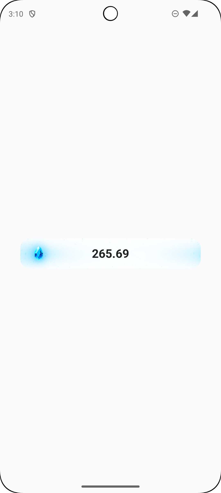
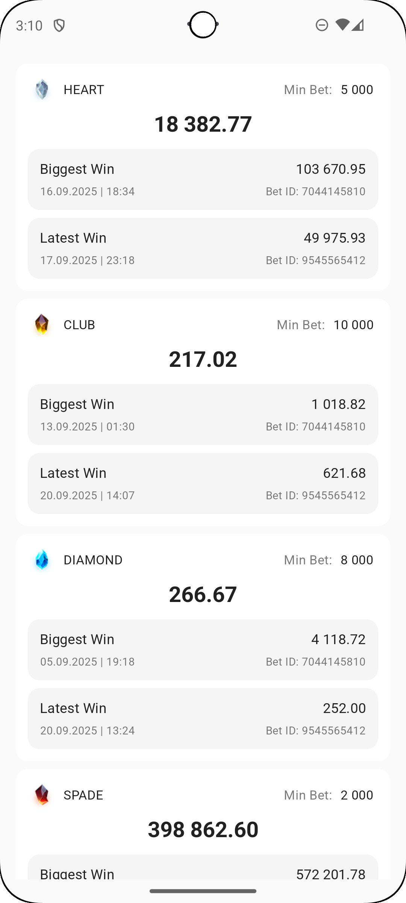
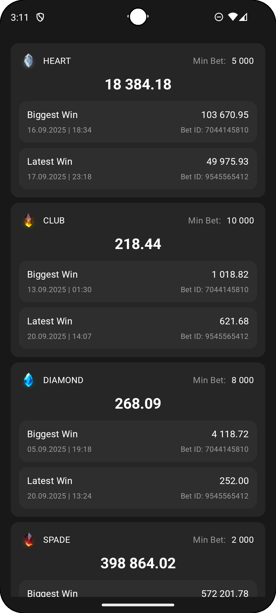

# Android Jackpot App

A modern Android application built with Jetpack Compose that displays jackpot data with real-time updates, featuring a clean design with both light and dark theme support.

## Demo

### Video Demo


*Watch the app in action with real-time jackpot updates, theme switching, and bottom sheet interactions*

### 📸 Screenshots

#### Light Theme
| Main Screen | Bottom Sheet |
|-------------|--------------|
|  |  |

#### Dark Theme
| Main Screen | Bottom Sheet |
|-------------|--------------|
|  |  |

### Download APK

**[Download Latest APK](assets/app-debug.apk)** - Install directly on your Android device

## Architecture

This application follows **MVI (Model-View-Intent)** architecture pattern with a **multi-modular** approach for better separation of concerns, testability, and maintainability.

### Architecture Overview

```
AndroidTask
├── app                    # Main application module
├── core
│   ├── common               # Common utilities and extensions
│   ├── data                 # Data layer implementation
│   ├── domain               # Business logic and use cases
│   ├── network              # Network layer with API services
│   └── ui                   # UI components and design system
└── feature
    └── jackpot              # Jackpot feature module
```

### MVI Pattern Implementation

- **Model**: Represents the state of the UI (`JackpotUiState`)
- **View**: Composable functions that render the UI based on state
- **Intent**: User actions and events (`JackpotIntent`)

The `JackpotViewModel` acts as the mediator, processing intents and updating the state accordingly.

### Multi-Modular Benefits

- **Separation of Concerns**: Each module has a specific responsibility
- **Reusability**: Core modules can be reused across features
- **Build Performance**: Parallel compilation and incremental builds
- **Team Collaboration**: Different teams can work on different modules
- **Testing**: Easier unit testing of isolated components

## Tech Stack

### Core Technologies
- **Kotlin**: 100% Kotlin codebase
- **Jetpack Compose**: Modern UI toolkit for native Android
- **Hilt**: Dependency injection framework
- **Coroutines & Flow**: Asynchronous programming and reactive streams
- **Material 3**: Google's latest design system

### Architecture Components
- **ViewModel**: UI-related data holder with lifecycle awareness
- **StateFlow**: State management for UI updates
- **Navigation Compose**: Type-safe navigation between screens

### Network & Data
- **Retrofit**: HTTP client for API communication
- **Kotlin Serialization**: JSON parsing and serialization
- **Repository Pattern**: Abstraction layer for data sources

### Build & Tools
- **Gradle KTS**: Kotlin-based build scripts
- **Version Catalogs**: Centralized dependency management
- **KSP**: Kotlin Symbol Processing for annotation processors

## Features

### Data Fetching & Management
- **Real-time Updates**: Continuous data fetching with Flow-based streams
- **Error Handling**: Robust error handling with UiState management
- **Loading States**: Proper loading indicators during data fetch

### Data Matching & Processing
The app intelligently processes jackpot data by:
- **Level Matching**: Matches widget info with jackpot items by `levelId`
- **Data Transformation**: Converts domain models to UI-friendly models
- **Currency Formatting**: Proper formatting based on currency and decimal places

### Ordering & Sorting
Jackpot items are displayed with intelligent sorting:
- **Primary Sort**: By `order` field from widget configuration
- **Secondary Sort**: By `levelId` for consistent ordering
- **Ascending Order**: Items displayed from lowest to highest priority

### UI Features
- **Adaptive Theming**: Automatic light/dark theme switching
- **Bottom Sheet**: Detailed jackpot information in modal bottom sheet
- **Responsive Design**: Optimized for different screen sizes
- **Material Design**: Following Material 3 design guidelines

### State Management
- **Centralized State**: Single source of truth with StateFlow
- **Intent-based Actions**: Clear separation of user intents
- **Immutable State**: Thread-safe state updates with data classes

## Design System

The app features a comprehensive design system with:
- **Custom Color Schemes**: Separate light and dark color palettes
- **Typography**: Material 3 typography scale
- **Component Library**: Reusable UI components
- **Theme Switching**: Seamless light/dark mode transitions

## Data Flow

1. **Data Source**: Network API provides jackpot data
2. **Repository**: Abstracts data access with error handling
3. **Use Case**: Encapsulates business logic for data processing
4. **ViewModel**: Manages UI state and processes user intents
5. **UI**: Renders state and sends intents back to ViewModel

```
API → Repository → UseCase → ViewModel → UI
                     ↑                   ↓
                  Domain Models      UI Events
```


### Setup
1. Clone the repository
2. Open in Android Studio
3. Sync project with Gradle files
4. Run the app on emulator or device

## Project Structure

```
src/main/kotlin/com/digitain/
├── androidtask/              # Main app module
├── core/
│   ├── common/              # Shared utilities
│   ├── data/                # Data layer
│   │   ├── datasource/      # Remote data sources
│   │   ├── repository/      # Repository implementations
│   │   └── mapper/          # Data mappers
│   ├── domain/              # Business logic
│   │   ├── model/           # Domain models
│   │   ├── repository/      # Repository interfaces
│   │   └── usecase/         # Use cases
│   ├── network/             # Network layer
│   │   ├── api/             # API service interfaces
│   │   ├── dto/             # Data transfer objects
│   │   └── di/              # Network DI modules
│   └── ui/                  # UI foundation
│       ├── designsystem/    # Theme and components
│       └── state/           # Common UI states
└── feature/jackpot/         # Jackpot feature
    ├── intent/              # User intents
    ├── model/               # UI models
    ├── state/               # UI states
    ├── ui/                  # Composable screens
    ├── viewmodel/           # ViewModels
    └── mapper/              # UI mappers
```

## Configuration

The app supports various configuration options:
- **API Endpoints**: Configurable base URLs
- **Refresh Intervals**: Customizable data refresh rates
- **Theme Preferences**: System/manual theme selection
---
